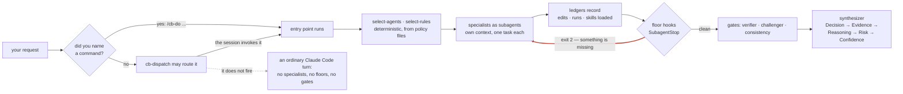
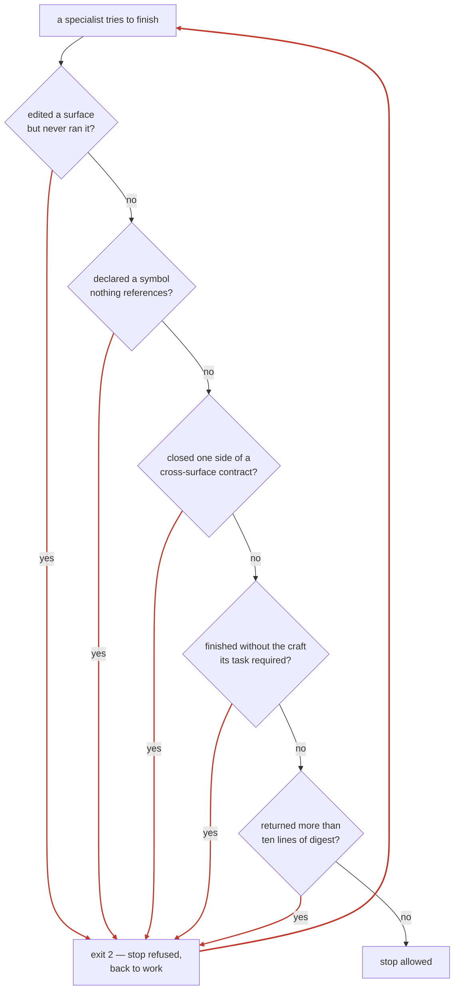
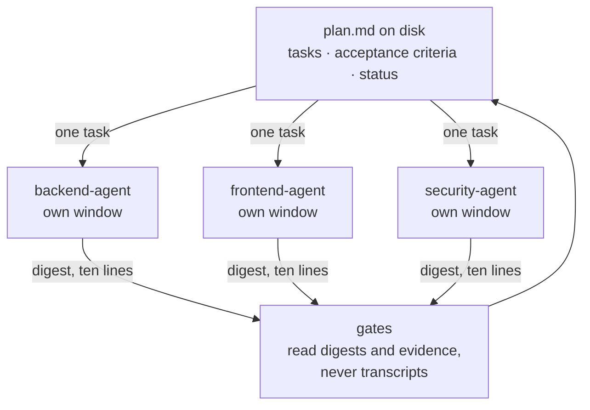

# Cereblnk

Cereblnk is a Claude Code plugin that turns engineering discipline into
mechanism.

When Claude Code writes code for you, the quality of the result depends
on whether the model remembered to check its work. Cereblnk narrows that
dependency. It ships specialist agents, the constraints they work under,
and — the part that matters — hooks that block an agent from finishing
when it skipped a step. A rule here is not a paragraph asking nicely. It
is a script with an exit code.

> "Context is expensive. Evidence is valuable. Verification is mandatory."

## The problem it addresses

An agent that edits a file and never runs it produces something that
looks finished. An agent that declares a function nothing ever calls
produces something that passes review. An agent that changes one side of
an API contract and stops produces a migration that reads as complete and
is not.

None of these are model failures you can prompt away, because in each
case the output is internally consistent and fluent. They are failures of
*absence* — something that should have happened did not, and nothing
noticed. Instructions do not catch absence. Only a check that runs
independently of the agent's own reasoning does.

That is the whole design. Every discipline in this repository either
names the script that detects its violation, or is labeled as unenforced.

## What it looks like in use

There are two ways in, and only one of them is guaranteed:



Read the dashed branch carefully, because it is the honest one.
`cb-dispatch` is a skill, and a skill fires when the session model
decides its description matches your message. Nothing in the plugin
forces that decision, and nothing detects a message that should have
routed and did not. **Type a command when it matters.**

Everything after the fork is where the design earns its keep. Selection
is a deterministic read of policy files rather than a judgment made in
the moment. No specialist reads the whole conversation or the whole
repository — each gets its own context window and sees only its own task.
And the red arrow, the refused stop, runs whether or not the model felt
like being careful.

## How it works

Four layers, each a directory you can read.

**Entry points** (`skills/*/SKILL.md`) — the sixteen `/cb-*` commands
below. They orchestrate; they do not do the work themselves.

**Agents** (`agents/`) — specialists in four groups. `core/` holds the
reasoning and gate roles: planner, verifier, challenger, consistency,
synthesizer. `engineering/` holds the domain specialists — backend,
frontend, database, security, qa, refactoring, performance, infra,
architect, apidesign, debugger, docs, testengineer. `lifecycle/` covers
requirements, documentation intake and technical writing. `context/`
covers compression, evidence collection, memory building, merging and
archiving.

**Constraints** (`rules/`) — loaded per task by `scripts/select-rules`
rather than all at once, because context is the expensive resource.

**Hooks** (`hooks/`) — eighteen scripts across seven Claude Code events:
`UserPromptSubmit`, `PreToolUse`, `PostToolUse`, `PreCompact`, `Stop`,
`SubagentStop`, `SessionEnd`. Twelve of them block; six record or
observe.

### What blocks a tool call

| Hook | Blocks |
|---|---|
| `delegation-guard` | A file edit in the conducting conversation while a run is active. Edits belong to surface specialists; this is the mechanism that three PRs of instructions could not achieve |
| `edit-boundary` | A write outside the declared directory during focused work |
| `destructive-command` | An irreversible shell operation. Opt-in through `/cb-careful`; routine build-artifact cleanups are allowlisted |
| `secret-guard` | A write whose content looks like a credential |
| `scratch-guard` | Working notes written to the repository root. A previous run left three debug files behind and they became someone's diff |
| `doc-floor` | An unbounded read of an indexed document, which spends the window on the way to the one clause that mattered |
| `post-edit-test` | Reports a failing test after an edit, when gate-3 work is flagged and a test command is configured |

### What blocks a finish

Five hooks decide whether a specialist may call itself done:



In order: `exec-floor`, `reach-floor`, `contract-floor`, `skill-floor`,
`digest-cap`. The first four each catch a failure the others cannot —
running a program is the one check no static gate performs; unwired code
fails by silence, so execution alone misses it; a contract needs both
directions checked, the new path present *and* the replaced path gone.
`digest-cap` is different in kind: it protects the conducting
conversation's headroom, because run discipline caps a subagent's return
at ten lines and until it existed nothing measured what came back.

Most blocking hooks fail open — a hook that cannot run says so and lets
the work through rather than freezing the session — and the floors are
nudge-capped, returning an agent to work a bounded number of times.

### Why context stays small

Context is the expensive resource, so it is not shared — knowledge is.
The plan lives on disk rather than in the conversation, each specialist
sees one task, and only digests travel back:



Nothing flows sideways between specialists, and the conducting
conversation carries plan, digests and verdicts — nothing else. This is
also what makes work survive a compaction: `plan-lint` refuses a
malformed plan, `plan-status` recovers state after a session dies, and
any single task can go to a fresh executor whose entire world is that one
task.

## Installation

```
/plugin marketplace add isumer/cereblnk
/plugin install cereblnk@cereblnk-marketplace
```

To test a local clone before installing from GitHub:

```
/plugin marketplace add ./cereblnk
/plugin install cereblnk@cereblnk-marketplace
```

### Enabling it every session

Installing is not the same as enabling. Once installed, commands, agents,
and skills load automatically **only while the plugin is enabled** in
`settings.json` via `enabledPlugins`. Set it once and it persists across
sessions.

**Personal (all your projects)** — add to `~/.claude/settings.json`:

```json
{
  "enabledPlugins": { "cereblnk@cereblnk-marketplace": true }
}
```

**Team / per-repo (shared, committed)** — add to the repo's
`.claude/settings.json` so every session opened in that repo has it on:

```json
{
  "extraKnownMarketplaces": {
    "cereblnk-marketplace": {
      "source": { "source": "github", "repo": "isumer/cereblnk" }
    }
  },
  "enabledPlugins": { "cereblnk@cereblnk-marketplace": true }
}
```

Project settings take precedence over user settings. Enabling from a
GitHub source in a shared `.claude/settings.json` does not silently
install it for teammates — each person is still prompted to trust and
install the plugin before it runs.

**"Installed but not working"?** Directory and local-marketplace installs
are a known gotcha: the plugin lands in `installed_plugins.json` but is
sometimes *not* added to `enabledPlugins`, so commands and hooks stay
silent. Fix: add the `enabledPlugins` line above by hand, then restart
the session.

## The commands

Sixteen skills start work. Type them as `/cb-pr-review`. The fully
qualified form is `/cereblnk:cb-pr-review` — plugin skills are always
namespaced, and the long form disambiguates if another plugin ships a
similar name.

Twelve of the sixteen end in the same fixed order: **Decision → Evidence
→ Reasoning → Risk → Confidence**. That ordering is the cognitive
contract, not a template — the decision comes first so a reader can stop
after one paragraph, and the risk section names what would falsify it.

### Routing

**`/cb-dispatch`** — routes a plain-language request to the right
workflow. It is the one command you are not meant to type: it is written
to fire on its own when you describe work touching a codebase without
naming a command, and to stay out of the way for pure knowledge
questions.

Whether it fires is a decision the session model makes by matching the
skill's description. Nothing in the plugin forces it, and nothing detects
a request that should have routed and did not — so treat automatic
routing as a convenience rather than a contract. When the work matters,
name the command yourself. If dispatch does not fire, you get an ordinary
Claude Code turn: no specialists, no floors, no gates.

**`/cb-orchestrate`** — the same routing decision, made explicitly and
shown to you: intent read at three levels, risk scored, then either the
fast path or the full multi-agent pipeline. Reach for it when you want to
see the reasoning behind the route rather than just the result.

### Deciding what to do

**`/cb-think`** — deliberate on a design, a bug theory or a tradeoff with
the relevant domain specialists. Divergent thinking, no mechanical
solution, no code. Reach for something else once the decision is made and
work should start.

**`/cb-frame`** — intent framing at product scale. It challenges the
literal request, extracts falsifiable premises, proposes sized
implementation paths, and writes a design brief for `/cb-design`. Reach
for it when you suspect the literal ask is not the real one; skip it when
you already know what to build.

**`/cb-requirements`** — turns a vague request into numbered, testable
requirements with measurable acceptance criteria, surfaced assumptions
and explicit out-of-scope, written to a requirement document. The
decision states whether the set is ready or blocked on rulings, and the
risk section carries unruled premises and open unknowns.

**`/cb-design`** — turns a confirmed brief into an executable spec:
architecture, data flow, state transitions, failure modes, trust
boundaries, diagrams and a test matrix. Risk carries assumed premises and
the counter-scenarios that survived challenge. There is no point running
this without a brief — run `/cb-frame` first.

### Building

**`/cb-do`** — direct execution. It analyses the request, selects
specialists, and builds through subagents. No spec, no design phase, no
plan to approve. Progress comes back as one fixed-format line pair per
task boundary with no prose between them, then the final synthesis.
Reach for `/cb-design` and `/cb-implement` instead when the change is
wide or risky enough that you would want to read a plan first.

**`/cb-implement`** — spec-driven build. The planner slices an approved
spec, specialists implement, and the verifier confirms each slice before
the next starts. Same per-slice line format: free-form narration is a
named trap here, because volume buries the finding.

**`/cb-refactor`** — behaviour-preserving restructuring. The invariant
checklist is written and shown before the first edit, naming observable
behaviours and the concrete check for each; an invariant with no
executable check either gets one or the scope shrinks to what is
checkable. Afterwards every item is re-verified, and any invariant that
cannot be re-verified downgrades the whole verdict. It engages the edit
boundary on the declared directory by itself.

### Checking

**`/cb-pr-review`** — production-incident hunting across a diff with
specialist agents and risk-scaled gates. The verdict is decision-first:
merge, do-not-merge, or merge-after-listed-fixes, with findings carrying
diff line references. Reach for `/cb-qa` when you want tests run rather
than a diff read.

**`/cb-bug`** — root-cause-first, hypothesis-driven tracing. No fix ships
without a demonstrated root cause: a reproduction or an
evidence-referenced trace, never a narration. Hypotheses are traced one
at a time, each ending in a labeled verdict. After three failed fix
attempts the workflow stops fixing and asks the architectural question
instead — a fourth patch is prohibited.

**`/cb-qa`** — a diff-aware test pass. It identifies the surfaces the
branch actually touched, executes the applicable test plan, and generates
a regression test for every confirmed fix. Risk names untested surfaces
and behaviours assumed equivalent.

**`/cb-security-audit`** — an OWASP Top 10 and threat-model sweep, always
at gate level 3. Every finding carries severity, an evidence reference
and a fix. Epistemic labels survive verbatim into the synthesis, so a
`derived` finding never arrives looking `known`. `/cb-pr-review` includes
a security pass; this is the deep one.

**`/cb-docs`** — diff-driven documentation sync. It finds every
documentation statement the diff made stale, applies the safe updates,
and surfaces the risky rewrites as questions rather than guessing. Reach
for it to repair documentation, not to write a new document.

### Session guards

**`/cb-careful`** — toggles the destructive-command hook for this
project, blocking irreversible shell operations until you turn it off.
Reach for it when working somewhere you cannot undo.

**`/cb-boundary <path>`** — declares (or clears) an edit boundary,
blocking writes outside the given directory during focused work.
`/cb-refactor` engages this on its own.

## Repository layout

```
cereblnk/                        # repo root = marketplace
├── .claude-plugin/marketplace.json
├── plugins/cereblnk/            # the Cereblnk plugin
│   ├── .claude-plugin/plugin.json
│   ├── agents/                  # core / engineering / lifecycle / context
│   ├── skills/                  # entry points at the top level,
│   │                            #   domain skills grouped below
│   ├── rules/                   # constraints — the enforceable form
│   ├── hooks/                   # hard-enforcement hooks
│   ├── protocols/               # Agent Communication Protocol (ACP)
│   ├── policies/                # risk model, budgets, quality gates
│   └── scripts/                 # budget, stack and selection computation
├── docs/                        # core documents 00–09
├── scripts/                     # verify and its suites
└── tests/                       # scenarios and checker fixtures
```

At runtime the plugin writes under `.claude/cereblnk/` in your project —
`config/`, `context/`, `docs/`, `flags/`, `history/`, `memory/`,
`state/`, `telemetry/`. None of it is shipped. `scripts/ensure-gitignore`
adds `.claude/` to your `.gitignore` once, skips a repository where it is
already covered, and can be opted out with a flag file; it is a guard
rather than a gate, so it never fails a run.

Where to read next: `docs/05_EXECUTION_REALITY_MAP.md` maps every concept
to the mechanism that implements it, and is the fastest way to separate
what is real here from what is aspiration. `docs/00_MANIFESTO.md` is the
contract every agent works under. `docs/TOPOLOGY.md` shows how work
reaches agents.

## Skills

Sixteen entry points sit at the top level. The rest are domain skills
grouped under `plugins/cereblnk/skills/`: `languages/` 19 ·
`frameworks/` 16 · `data/` 7 · `infrastructure/` 8 · `delivery/` 6 ·
`practices/` 21. Skills load lazily by description; agents pull their set
via frontmatter plus the relations closure
(`policies/skill-relations-policy.md`, checked by
`scripts/check-skill-relations`).

## Running on a smaller model

Most of what makes an answer good here lives outside the model.

That is the design bet: a weaker session model fails less because the
structure it works inside does the remembering, the sequencing and the
checking. Four mechanisms carry it, and each is a file you can read.

**The strong tier is spent where being wrong is unrecoverable.**
`policies/model-tiering-policy.md` is a seating plan, not a model list —
the plugin ships no model names, because names age with the platform's
lineup and cost belongs to you. Planner, verifier, challenger and
synthesizer want the strongest tier available: a bad task graph is
executed faithfully by every cheaper agent after it, and a weak verifier
nods along. The consistency agent compares labels and IDs mechanically
and wants the lightest, because intelligence there is wasted budget.
Specialists inherit the session model. Set `model:` in an agent's
frontmatter and the platform enforces it — a pinned field does not
degrade the way a prompt does.

**A weaker conductor gets a smaller mesh.** The same policy's §4 names
something easy to miss: a weaker model does not only build worse, it
*coordinates* worse — every extra agent is another chance to mis-fill a
Task Block or drop a digest. So the topology adapts: fewer and larger
slices, parallel specialists capped at what the risk actually requires.

**The plan lives on disk, not in the conversation** — see the diagram
above. Minimal context, maximal structure, and no dependence on what the
model still remembers.

**The checks are mechanical.** Gates compare fact IDs and epistemic
labels; hooks block on exit codes. Neither is impressed by fluent
writing, which is exactly the failure a smaller model is most likely to
produce.

Note what this is not: the plugin does not connect Claude Code to a model
of your choosing — that is a platform and configuration matter, outside
what ships here. And the effect is unmeasured. The mechanisms are
inspectable; how much they close the gap on any particular model is not
something this repository has established.

## Risk and gates

Depth is dynamic rather than uniform: low risk moves fast with minimal
verification, high risk gets more agents, deeper verification and
contrarian review. Three levels, set by `scripts/select-agents` and
raisable by any agent at any time:

| Level | Risk | Who reviews |
|---|---|---|
| 1 | Low | Self-verification by the executing agent |
| 2 | Medium | Verifier + consistency |
| 3 | High | Verifier + challenger + consistency, all mandatory |

Risk is never silently downgraded, and one class is fixed regardless of
how simple the change looks: security-surface, auth, data-deletion,
migration, money and production-config work is always level 3.

## Status & maturity

Current contents: **26 agents · 93 skills (16 of them entry points) ·
176 constraint files · 18 hooks · 28 verify suites** (count them:
`find plugins/cereblnk/agents -name '*-agent.md' | wc -l`,
`find plugins/cereblnk/skills -name SKILL.md | wc -l`,
`ls plugins/cereblnk/hooks/scripts/*.sh | wc -l`). `scripts/check-readme`
fails the build when these drift.

Claims are labeled the way this platform labels facts:

| Layer | Status | Evidence |
|---|---|---|
| Manifests, hooks, guard scripts, xmltools, docparse, docindex, skill graph, ACP/plan linters, agent selection | **Verified (scripted)** | `scripts/verify` — one deterministic pass, exit-code + expected-output + failure/unsupported paths, golden files for docparse |
| Workflows, agents, dispatch routing (prompt-driven behavior) | **Implemented, manually validated** | `tests/*.md` scenarios executed by hand |

Honest boundary: `scripts/verify` green does NOT verify workflow
behavior — treating it as if it did is exactly the "all tests pass" trap
the manual warns about (09 Part II #8). One of the 28 suites, the
reference-string leakage scan, skips unless a wordlist is configured; a
skip is printed and never counted as a pass.

Two things in particular are unenforced, and worth knowing before you
rely on them. Automatic routing through `cb-dispatch` depends on the
session model matching a skill description, and nothing checks a request
that should have routed and did not. The hook names printed in this file
are not compared against `hooks/scripts/`, so a rename would leave this
page quietly wrong until someone noticed.

What this repository does **not** contain: a retrieval index, an
embedding or vector store, a standalone command-line binary, or a
persistent cross-session memory layer. Memory here is files under
`.claude/cereblnk/memory/` — durable plans, contract artifacts and
promoted evidence. Anything else is F-class in
`docs/05_EXECUTION_REALITY_MAP.md`, which means it does not exist and
must not be designed against.

## License

MIT — see [LICENSE](LICENSE).
