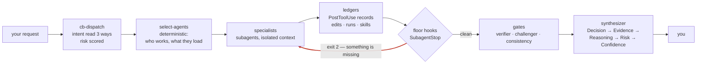
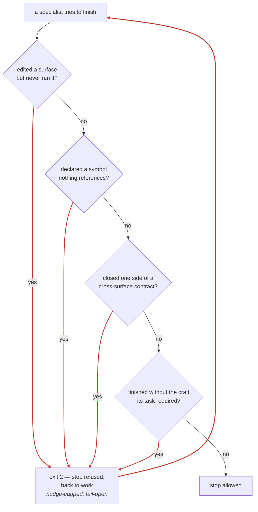
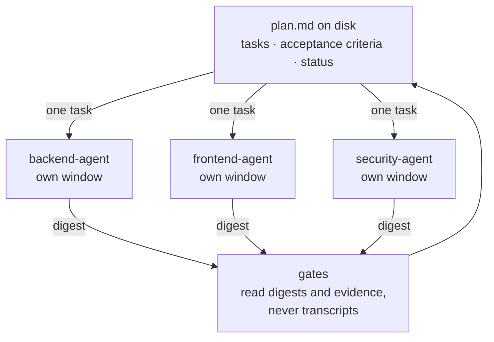

# Cereblnk

Cereblnk is a Claude Code plugin that turns engineering discipline into
mechanism.

When Claude Code writes code for you, the quality of the result depends
on whether the model remembered to check its work. Cereblnk removes that
dependency. It ships specialist agents, the constraints they work under,
and — the part that matters — hooks that block an agent from finishing
when it skipped a step. A rule here is not a paragraph asking nicely. It
is a script with an exit code.

> "Context is expensive. Evidence is valuable. Verification is mandatory."

## The problem it addresses

An agent that edits a file and never runs it produces something that
looks finished. An agent that declares a function nothing ever calls
produces something that passes review. An agent that changes one side of
an API contract and stops produces a migration that reads as complete and
is not.

None of these are model failures you can prompt away, because in each
case the output is internally consistent and fluent. They are failures of
*absence* — something that should have happened did not, and nothing
noticed. Instructions do not catch absence. Only a check that runs
independently of the agent's own reasoning does.

That is the whole design. Every discipline in this repository either
names the script that detects its violation, or is labeled as unenforced.

## What it looks like in use

You describe work in plain language, or name a command directly:

```
/cb-do add rate limiting to the auth endpoints
```

What happens next:



Risk scoring is not cosmetic: auth, money, deletion, migration and
production config take the deep pass regardless of how small the change
looks. Agent and skill selection is a deterministic read of policy files,
not a judgment made in the moment. And no specialist reads the whole
conversation or the whole repository — each one gets its own context
window and sees only its own task.

The red arrow is the part you will not find in a prompt library. It runs
whether or not the model felt like being careful.

## The workflows

Each lane carries one rule it will not bend. `/cb-do` will not edit a
file in the conversation. `/cb-bug` will not propose a fix before a
demonstrated root cause, and stops fixing entirely after three failed
attempts. `/cb-refactor` writes the invariant contract before the first
edit, and an invariant with no executable check either gets one or the
scope shrinks to what is checkable.

Memory here is files under `.claude/cereblnk/memory/` — durable plans a
linter refuses when malformed, contract artifacts a script reconciles,
and evidence promoted when it outlives its run. No embeddings, no
similarity search, no cross-session recall.

## How it works

Four layers, each a directory you can read.

**Entry points** (`skills/*/SKILL.md`) — the 16 `/cb-*` commands below.
They orchestrate; they do not do the work themselves.

**Agents** (`agents/`) — 26 specialists in four groups. `core/` holds the
reasoning and gate roles: planner, verifier, challenger, consistency,
synthesizer. `engineering/` holds the domain specialists — backend,
frontend, database, security, qa, refactoring, performance, infra,
architect, apidesign, debugger, docs, testengineer. `lifecycle/` covers
requirements and documentation intake. `context/` covers compression,
evidence collection and archiving.

**Constraints** (`rules/`) — 176 files, loaded per task by
`scripts/select-rules` rather than all at once, because context is the
expensive resource.

**Hooks** (`hooks/`) — 18 scripts across seven Claude Code events:
`PreToolUse`, `PostToolUse`, `PreCompact`, `Stop`, `SubagentStop`,
`SessionEnd`, `UserPromptSubmit`. This is the enforcement layer.

Four of them decide whether a specialist is allowed to call itself done:



Each question is a hook. In order: `exec-floor`, `reach-floor`,
`contract-floor`, `skill-floor`.

The full set that blocks rather than observes:

| Hook | Blocks when |
|---|---|
| `exec-floor` | A specialist edited a surface and never ran it. Running a program is the one check no static gate performs |
| `reach-floor` | A symbol was declared whose identifier appears nowhere outside its own declaration line. Unwired code fails by silence, so execution alone does not catch it |
| `contract-floor` | One side of a cross-surface contract closed unmatched. Both directions are checked — the new path present *and* the replaced path gone |
| `skill-floor` | A specialist finished without loading the craft its task required |
| `doc-floor` | An indexed document was read unbounded instead of by citation |
| `edit-boundary` | Work strayed outside a declared directory |
| `destructive-command` | An irreversible shell operation ran under `/cb-careful` |
| `secret-guard` | A credential was about to be written or echoed |

Floor hooks are nudge-capped and fail-open: they return an agent to work
a bounded number of times, and a hook that cannot run does not freeze the
session.

### Why context stays small

Context is the expensive resource, so it is not shared — knowledge is.
The plan lives on disk rather than in the conversation, each specialist
sees one task, and only digests travel back:



Nothing flows sideways between specialists, and the conductor
conversation carries plan, digests and verdicts — nothing else. This is
also what makes the work survive a compaction: any model resumes by
reading `plan-status`, and any single task can be handed to a fresh
executor whose entire world is that one task.

## Installation

```
/plugin marketplace add isumer/cereblnk
/plugin install cereblnk@cereblnk-marketplace
```

To test a local clone before installing from GitHub:

```
/plugin marketplace add ./cereblnk
/plugin install cereblnk@cereblnk-marketplace
```

### Enabling it every session

Installing is not the same as enabling. Once installed, commands, agents,
and skills load automatically **only while the plugin is enabled** in
`settings.json` via `enabledPlugins`. Set it once and it persists across
sessions — no reinstall, no per-session step.

**Personal (all your projects)** — add to `~/.claude/settings.json`:

```json
{
  "enabledPlugins": { "cereblnk@cereblnk-marketplace": true }
}
```

**Team / per-repo (shared, committed)** — add to the repo's
`.claude/settings.json` so every session opened in that repo has it on:

```json
{
  "extraKnownMarketplaces": {
    "cereblnk-marketplace": {
      "source": { "source": "github", "repo": "isumer/cereblnk" }
    }
  },
  "enabledPlugins": { "cereblnk@cereblnk-marketplace": true }
}
```

Project settings take precedence over user settings. Enabling from a
GitHub source in a shared `.claude/settings.json` does not silently
install it for teammates — each person is still prompted to trust and
install the plugin before it runs.

**"Installed but not working"?** Directory/local-marketplace installs are
a known gotcha: the plugin lands in `installed_plugins.json` but is
sometimes *not* added to `enabledPlugins`, so commands and hooks stay
silent. Fix: add the `enabledPlugins` line above by hand, then restart
the session.

Enabling loads the skills; it does not guarantee that `cb-dispatch`
auto-triggers on a given message. For a guaranteed entry point, start
work with an explicit command such as `/cb-pr-review`.

## Commands

Sixteen skills start work. You rarely need to pick one: **cb-dispatch**
reads a plain-language request, scores risk, and routes automatically,
announcing the route in one line. An explicit command always wins over
the router, and knowledge questions never trigger it.

Type them as `/cb-pr-review`. The fully qualified form is
`/cereblnk:cb-pr-review` — plugin skills are always namespaced, and the
long form is what disambiguates if another plugin ships a similar name.

### Deciding what to do

| Command | Reach for it when | Reach for something else when |
|---|---|---|
| `/cb-think` | You want to reason a problem through — a design, a bug theory, a tradeoff — with the relevant specialists. No code comes out | The decision is already made and you want work to start |
| `/cb-frame` | The request is vague at product scale and you suspect the literal ask is not the real one. Produces a design brief | You already know what to build |
| `/cb-requirements` | You need the vague thing turned into numbered, testable requirements before anyone estimates or builds | The scope is one file and obvious |
| `/cb-design` | A brief is confirmed and you need the executable spec — architecture, data flow, failure modes, trust boundaries, test matrix | There is no brief yet; run `/cb-frame` first |

### Building

| Command | Reach for it when | Reach for something else when |
|---|---|---|
| `/cb-do` | You know what you want and want it built now. Selects specialists and builds through subagents. No spec, no plan to approve | The change is risky or wide enough that you would want to read a plan first — use `/cb-design` then `/cb-implement` |
| `/cb-implement` | An approved spec exists and you want it built slice by slice, each verified before the next starts | You have no spec — that is `/cb-do` |
| `/cb-refactor` | Structure needs to change and behaviour must not. Invariants are listed before and re-checked after | Behaviour is meant to change — that is a build or a fix |

### Checking

| Command | Reach for it when | Reach for something else when |
|---|---|---|
| `/cb-pr-review` | A diff is ready and you want production incidents hunted, not style noted | You want tests run — that is `/cb-qa` |
| `/cb-bug` | Something is broken and you want the cause, not a patch. No fix ships without a demonstrated root cause | You already know the cause and just want it fixed |
| `/cb-qa` | You want the test surfaces the branch actually touched exercised, plus a regression test per confirmed fix | You want a code read rather than a test run |
| `/cb-security-audit` | Auth, secrets, trust boundaries, or anything you would not want wrong. Always runs at gate level 3 | You want general review — `/cb-pr-review` includes a security pass |
| `/cb-docs` | A diff has made documentation stale and you want every affected statement found | You are writing a new document rather than repairing one |

### Session guards

| Command | Reach for it when |
|---|---|
| `/cb-careful` | Working somewhere destructive. Blocks irreversible shell operations until turned off |
| `/cb-boundary <path>` | Focused work that must not touch anything outside one directory. `/cb-refactor` engages this on its own |

### Runtime

| Command | Reach for it when |
|---|---|
| `/cb-orchestrate` | You want the routing decision made explicitly and shown — three-level intent read, risk score, fast path or full pipeline |
| `/cb-dispatch` | Never typed. It is the router that runs when you describe work without naming a command |

Every command takes an argument; run one with no argument and it will say
what it wants.

## Repository layout

```
cereblnk/                        # repo root = marketplace
├── .claude-plugin/marketplace.json
├── plugins/cereblnk/            # the Cereblnk plugin
│   ├── .claude-plugin/plugin.json
│   ├── agents/                  # core / engineering / lifecycle / context
│   ├── skills/                  # entry points at the top level,
│   │                            #   domain skills grouped below
│   ├── rules/                   # constraints — the enforceable form
│   ├── hooks/                   # hard-enforcement hooks
│   ├── protocols/               # Agent Communication Protocol (ACP)
│   ├── policies/                # risk model, budgets, quality gates
│   └── scripts/                 # budget, stack and selection computation
├── docs/                        # core documents 00–09
├── scripts/                     # verify and its suites
└── tests/                       # scenarios and checker fixtures
```

`memory/`, `context/`, and `telemetry/` directories are created at runtime
in the user's project under `.claude/cereblnk/` — never shipped, and
ignored by git from the moment the directory appears.

Where to read next: `docs/05_EXECUTION_REALITY_MAP.md` maps every concept
to the mechanism that implements it, and is the fastest way to separate
what is real here from what is aspiration. `docs/00_MANIFESTO.md` is the
contract every agent works under. `docs/TOPOLOGY.md` shows how work
reaches agents.

## Skills

Sixteen entry points sit at the top level (above). The other 77 of the 93
skills are domain skills grouped under `plugins/cereblnk/skills/`:
`languages/` 19 · `frameworks/` 16 · `data/` 7 · `infrastructure/` 8 ·
`delivery/` 6 · `practices/` 21. Skills load lazily by description;
agents pull their set via frontmatter plus the relations closure
(`policies/skill-relations-policy.md`, checked by
`scripts/check-skill-relations`).

## Running on a smaller model

Most of what makes an answer good here lives outside the model.

That is the design bet: a weaker session model fails less because the
structure it works inside does the remembering, the sequencing and the
checking. Four mechanisms carry it, and each is a file you can read.

**The strong tier is spent where being wrong is unrecoverable.**
`policies/model-tiering-policy.md` is a seating plan, not a model list —
the plugin ships no model names, because names age with the platform's
lineup and cost belongs to you. Planner, Verifier, Challenger and
Synthesizer want the strongest tier available; the Consistency agent
compares labels mechanically and wants the lightest; specialists inherit
the session. Set `model:` in an agent's frontmatter and the platform
enforces it — a pinned field does not degrade the way a prompt does.

**A weaker conductor gets a smaller mesh.** The same policy's §4 names
something easy to miss: a weaker model does not only build worse, it
*coordinates* worse — every extra agent is another chance to mis-fill a
Task Block or drop a digest. So the topology adapts: fewer and larger
slices, parallel specialists capped at what the risk actually requires.

**The plan lives on disk, not in the conversation** — see the diagram
above. Minimal context, maximal structure, and no dependence on what the
model still remembers.

**The checks are mechanical.** A gate compares fact IDs and epistemic
labels; hooks block on exit codes. Neither is impressed by fluent
writing, which is exactly the failure a smaller model is most likely to
produce.

Note what this is not: the plugin does not connect Claude Code to a model
of your choosing — that is a platform and configuration matter, outside
what ships here. And the effect is unmeasured. The mechanisms are
inspectable; how much they close the gap on any particular model is not
something this repository has established.

## Status & maturity

Current contents: **26 agents · 93 skills (16 of them entry points) ·
176 constraint files · 18 hooks · 28 verify suites** (count them:
`find plugins/cereblnk/agents -name '*-agent.md' | wc -l`,
`find plugins/cereblnk/skills -name SKILL.md | wc -l`,
`ls plugins/cereblnk/hooks/scripts/*.sh | wc -l`). `scripts/check-readme`
fails the build when these drift. Versioning follows CHANGELOG.md semver;
one behavior-changing change = one patch bump (CONTRIBUTING.md).

Claims are labeled the way this platform labels facts:

| Layer | Status | Evidence |
|---|---|---|
| Manifests, hooks, guard scripts, xmltools, docparse, docindex, skill graph, ACP/plan linters, agent selection | **Verified (scripted)** | `scripts/verify` — one deterministic pass, exit-code + expected-output + failure/unsupported paths, golden files for docparse |
| Workflows, agents, dispatch routing (prompt-driven behavior) | **Implemented, manually validated** | `tests/*.md` scenarios executed by hand |

Honest boundary: `scripts/verify` green does NOT verify workflow
behavior — treating it as if it did is exactly the "all tests pass" trap
the manual warns about (09 Part II #8).

What this repository does **not** contain: a retrieval index, an
embedding or vector store, a standalone command-line binary, or a
persistent cross-session memory layer. Those are tracked as F-class in
`docs/05_EXECUTION_REALITY_MAP.md`, which means they do not exist and
must not be designed against.

## License

MIT — see [LICENSE](LICENSE).
