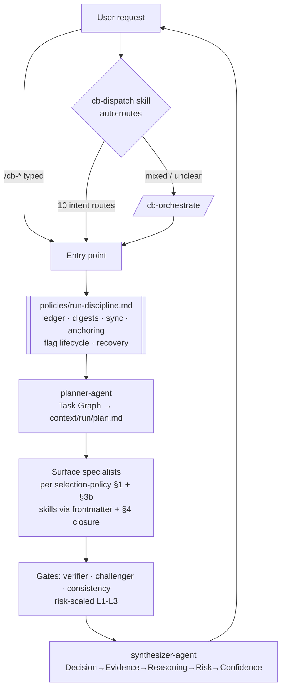

# Cereblnk Topology

> How work reaches agents, and what carries it there. Derived from
> repository state — agent frontmatter, entry points, dispatch routes,
> skill relations. Regenerate this when the wiring changes; the
> mechanical facts behind it are checked by `scripts/verify`
> (`check-agent-skills`, `check-skill-relations`, `select-agents`).

## 1. Entry flow (how work reaches agents)

Dispatch carries 10 intent routes plus an orchestrate fallback for
mixed or unclear requests. Gate agents are present in every
gate-bearing entry point.

The run contract reaches an entry point two ways: eight of them bind
`policies/run-discipline.md` by name, and `/cb-orchestrate` implements
the same rules — ledger, digests, wave sequencing, flag lifecycle —
inline. Two copies of one contract is a drift risk worth knowing about.
The remaining entry points run no pipeline: `careful` and `boundary`
are session guards, `dispatch` hands off, and `think`, `frame`,
`requirements` and `docs` produce artifacts without a specialist mesh.

## 2. The operating rule, in one sentence

Dispatch routes every request → the workflow loads run-discipline →
planner slices → **each slice's surface specialist executes it inside
its own context with its skill closure loaded** → gates verify →
synthesizer speaks. The conductor conversation carries plan, digests,
verdicts — nothing else.
