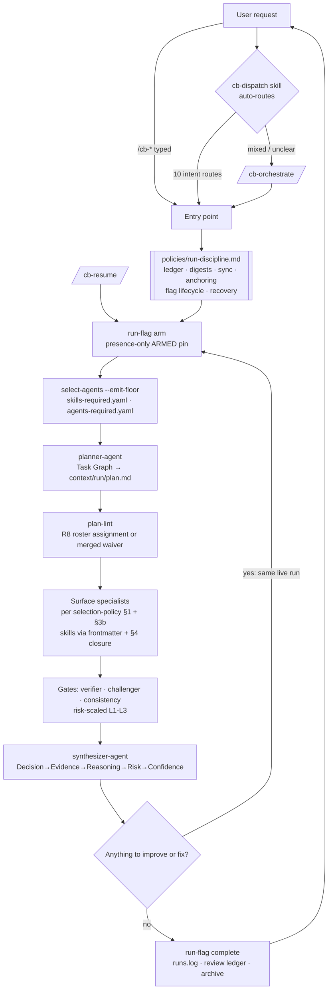

# Cereblnk Topology

> How work reaches agents, and what carries it there. Derived from
> repository state — agent frontmatter, entry points, dispatch routes,
> skill relations. Regenerate this when the wiring changes; the
> mechanical facts behind it are checked by `scripts/verify`
> (`check-agent-skills`, `check-skill-relations`, `select-agents`).

## 1. Entry flow (how work reaches agents)

```mermaid
flowchart TD
    U[User request] --> D{cb-dispatch skill\nauto-routes}
    U -->|/cb-* typed| W
    D -->|10 intent routes| W[Entry point]
    D -->|mixed / unclear| O[/cb-orchestrate/]
    O --> W
    R[/cb-resume/] --> ARM
    W --> RD[[policies/run-discipline.md\nledger · digests · sync · anchoring\nflag lifecycle · recovery]]
    RD --> ARM[run-flag arm\npresence-only ARMED pin]
    ARM --> SEL[select-agents --emit-floor\nskills-required.yaml · agents-required.yaml]
    SEL --> P[planner-agent\nTask Graph → context/run/plan.md]
    P --> PL[plan-lint\nR8 roster assignment or merged waiver]
    PL --> S[Surface specialists\nper selection-policy §1 + §3b\nskills via frontmatter + §4 closure]
    S --> G[Gates: verifier · challenger · consistency\nrisk-scaled L1-L3]
    G --> SY[synthesizer-agent\nDecision→Evidence→Reasoning→Risk→Confidence]
    SY --> A{Anything to improve or fix?}
    A -->|yes: same live run| ARM
    A -->|no| C[run-flag complete\nruns.log · review ledger · archive]
    C --> U
```

Dispatch carries 10 intent routes plus an orchestrate fallback for
mixed or unclear requests. Gate agents are present in every
gate-bearing entry point.

Pipeline entry points bind `policies/run-discipline.md` by name, while
`/cb-orchestrate` also spells out the same ledger, digest, wave and flag
rules inline. Two copies of one contract is a drift risk worth knowing
about. The non-pipeline surfaces have narrower jobs: `careful` and
`boundary` are session guards, `catchup` reads and acknowledges the
review ledger, `dispatch` hands off, `think`, `frame`, `requirements`
and `docs` produce artifacts, and `resume` re-enters an existing pinned
pipeline rather than creating a new one.

The terminal edge is now disk-backed. `complete` writes cost/task
telemetry, adds a review-ledger record for shipping runs, and moves the
live ledger to `archive/<run_id>/`; `abandon` archives without successful
completion telemetry or a completed sentinel. The improve/fix question
before that edge is instruction-enforced, not a hook: the Reality Map
labels that honest limit explicitly.

## 2. The operating rule, in one sentence

Dispatch routes every request → the workflow loads run-discipline →
planner slices → **each slice's surface specialist executes it inside
its own context with its skill closure loaded** → gates verify →
synthesizer speaks. The conductor conversation carries plan, digests,
verdicts — nothing else.
